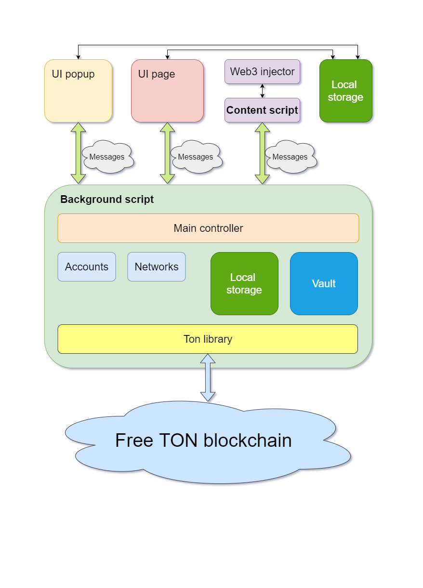

# My TON wallet (MTW)

<div align="center">
  
</div>

This repository contains source code for web-extension that allow interaction with Free Ton blockchain from your browser.

# Security

* Based on TON SDK with minimal required dependencies
* Wallet keys decrypt only when needs and via in-memory password, that stores in the one variable
* IndexedDb stores only common information, like transaction history, etc.
* Key pair is encrypted with AES-GCM
* Password checking is provided by the comparison of a random hex key with length 256 that is stored in indexedDb and its encrypted hash that was obtained by AES-GCM with password inclusion. In this case to get master password needs to decrypt encrypted data that must be equal to the hex string by 256 length
* Code develops accordance with [state-of-the-art security standards](https://developer.chrome.com/docs/extensions/mv3/security/)

# Browser supporting

* Chrome [install](https://chrome.google.com/webstore/detail/mtw/neopaklikggjkdflfmfebibdpcebomfh)
* Firefox [install](https://github.com/mytonwallet/web-extension/releases)
* Edge [install](https://microsoftedge.microsoft.com/addons/detail/mtw-%D0%BC%D0%BE%D0%B9-ton-%D0%BA%D0%BE%D1%88%D0%B5%D0%BB%D0%B5%D0%BA/oooiblbdpdlecigodndinbpfopomaegl)
* Opera [install](https://github.com/mytonwallet/web-extension/releases)
* Safari [install](https://github.com/mytonwallet/web-extension/releases)

# Architecture

## Application



## User flow


# Tests

Testing system is based on [selenium](https://www.selenium.dev/) and [mochajs](https://mochajs.org/) for e2e testing and [testing-library](https://testing-library.com/docs/svelte-testing-library/intro) for components

To test need to run:

```bash
npm run test
```

# Technical stack

* [rollup.js](https://rollupjs.org/guide/en/) for building processes
* [svelte.js](https://svelte.dev/) for javascript framework
* [chota](https://alexxnb.github.io/svelte-chota) for style
* [idb](https://www.npmjs.com/package/idb) for internal db
* [ton-client-js](https://github.com/tonlabs/ton-client-js) for interaction with Free TON blockchain
* [safemultisig](https://github.com/tonlabs/ton-labs-contracts/tree/master/solidity/safemultisig) for multisig wallet smart contract
* [webextension-polyfill](https://github.com/mozilla/webextension-polyfill) for cross browser supporting
* [gulp.js](https://gulpjs.com/) for building distributives for browsers
* [selenium](https://www.selenium.dev/) for e2e testing
* [testing-library](https://testing-library.com/docs/svelte-testing-library/intro) for component testing

# Contribution

Anyone can participate in contribution. Pull request (PR) is welcome.

# License

This repository provides by [Apache License 2.0](LICENSE)

# Distribution and mode for developers

To prepare environment need to run:

```
npm i
```

To run developer mode:

```
npm start
```

To prepare build need to run:

```
npm run dist
```

This command will generate a zip file for each browser.

For the best developer environment we recommend to use launch [tonlabs/local-node](https://hub.docker.com/r/tonlabs/local-node)

To run local TON node you have to install [docker](https://docs.docker.com/engine/install/)

To start the local TON node just run:

```
npm run run-tonos
```

# Documentation

All documentation you can find by this [link](https://mytonwallet.com)

# Translations

For now the extension is available on the followed languages:
* English
* Russian

If you are native speaker on any other language and can help with translation, please use this file as [source](/src/assets/i18n/en.json)

# Steps for a new release

* Run tests

```
  npm run test
```

* Create a commit with a description

* Increase a version in package.json and manifest.json and update CHANGELOG file

```
  npm run version
```

* Create builds for browsers

```
  npm run build
```

# Requested features

- [x] Multi accounts
- [ ] Dapp connector for the signing transactions, the signing messages, the encrypt/decrypt messages
- [ ] Creating multisign wallet (many owners, requirement count more than 0)
- [ ] Adding tokens and interactions with them
- [ ] DePools supporting
- [ ] Loading ABI for the smart contract interaction
- [ ] Smart contract editing/compiling/deploying right from the web extension
- [ ] Mobile version for IOS/Android platforms with the same functionality as in browsers
- [ ] Qr codes for the payment system via the mobile version (the payment sending, ask payment, the deep link)
- [ ] Onboarding library for Dapp for the quick installation of the web extension or the mobile version
- [ ] Swipe operations
- [ ] DEX supporting
- [ ] Buying on external exchanges
- [ ] Supporting of easy conversion between currencies
- [ ] Hard wallet supporting
- [ ] Fishing blacklist with the voting process on Free TON blockchain
